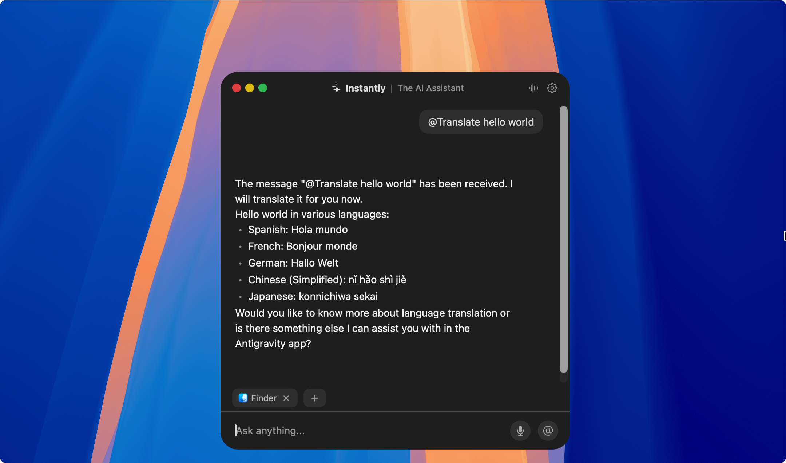

<div align="center">
  

  <h1>✦ Instantly</h1>
  <p><strong>Your always-ready AI assistant for macOS.</strong></p>

  <p>
    A native macOS AI assistant that lives in a floating panel, summoned with a hotkey.<br/>
    Built with <a href="https://developer.apple.com/xcode/swiftui/">SwiftUI</a>, powered by <a href="https://ollama.com/">Ollama</a>.
  </p>

  <p>
    <a href="#features">Features</a> •
    <a href="#installation">Installation</a> •
    <a href="#getting-started">Getting Started</a> •
    <a href="#usage">Usage</a> •
    <a href="#contributing">Contributing</a>
  </p>

  <p>
    
    
  </p>
</div>

---

## Features

- **⌨️ Hotkey Activation** — Summon the assistant instantly with a global keyboard shortcut.
- **💬 Floating Panel** — A sleek, always-accessible chat panel that stays out of your way.
- **🤖 Ollama Integration** — Chat with local LLMs privately, no data leaves your machine.
- **📎 Active App Context** — Automatically detects the active app for context-aware assistance.
- **🏷️ @Mentions** — Use `@actions` to trigger quick actions like translation, summarization, and more.
- **⚙️ Customizable Settings** — Configure models, assistants, appearance, and hotkeys to your liking.
- **🌙 Dark Mode** — Beautiful dark mode interface that feels native to macOS.
- **🚀 Launch at Login** — Optionally start Instantly when your Mac boots up.

## Requirements

- macOS 14.0+
- Xcode 16.0+ (for development only)
- [Ollama](https://ollama.com/) installed and running locally

## Installation

### Manual (Recommended)

Download the latest DMG from the [Releases](https://github.com/duongductrong/Instantly/releases) page, open it, and drag **Instantly.app** to your **Applications** folder.

> **Note:** Instantly is signed with a self-signed certificate. When opening for the first time, right-click the app and select **Open**. Accessibility permissions persist across updates.

### Homebrew

```bash
brew install --cask https://raw.githubusercontent.com/duongductrong/Instantly/master/Casks/instantly.rb
```

### Auto-Updates

Instantly includes [Sparkle](https://sparkle-project.org/) for automatic updates. The app checks for updates daily and notifies you when a new version is available.

## Getting Started

1. **Install Ollama**

   Download and install from [ollama.com](https://ollama.com/), then pull a model:

   ```bash
   ollama pull llama3
   ```

2. **Clone & Open**

   ```bash
   git clone https://github.com/duongductrong/Instantly.git
   cd Instantly
   open Instantly.xcodeproj
   ```

3. **Build & Run**

   Press `⌘R` in Xcode. Grant **Accessibility** permission when prompted.

## Usage

- Press your configured hotkey to summon the floating panel.
- Type a message or use `@` to mention a quick action (e.g. `@Translate hello world`).
- The assistant responds using your locally running Ollama model — fast and private.

## CI/CD

Instantly uses GitHub Actions for continuous integration and automated releases. See [`docs/ci-cd-workflow.md`](docs/ci-cd-workflow.md) for detailed architecture and workflow diagrams.

**Workflows:**
- **CI Build Check** — Builds and tests on every push/PR
- **Release Prepare** — Bumps version and creates release PR on `release(patch|minor|major):` commits
- **Release Publish** — Archives, signs, packages DMG, and publishes GitHub Release when release PR merges
- **Release Notify** — Sends Discord notification on successful release

## Contributing

```bash
git clone https://github.com/duongductrong/Instantly.git
cd Instantly
open Instantly.xcodeproj
```

Build and run with `⌘R`. PRs and issues are welcome!

## License

MIT License — see the [LICENSE](LICENSE) file for details.
