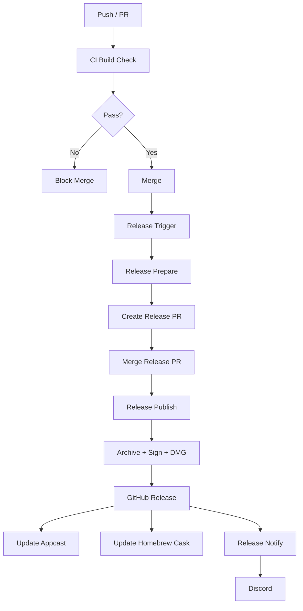
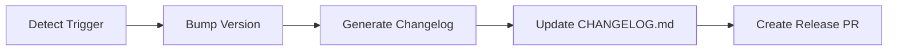
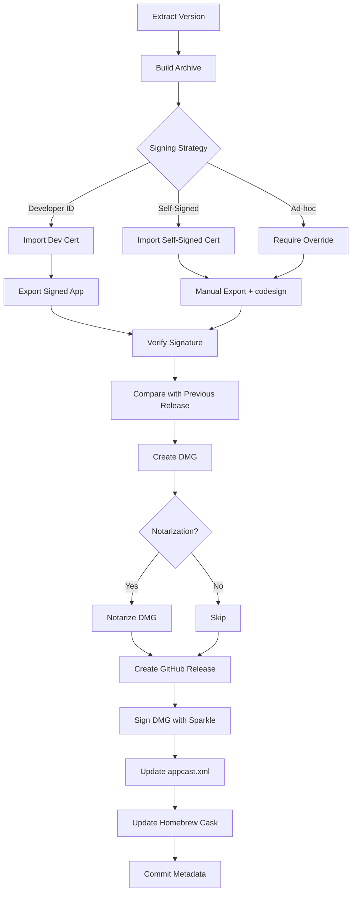

# CI/CD Workflow

This document describes the automated build, test, release, and distribution pipeline for Instantly.

## Overview

The CI/CD system consists of four GitHub Actions workflows that handle continuous integration, automated releases, and distribution notifications.



## Workflows

### 1. CI Build Check

Runs on every push to `master` and every pull request.


**File:** `.github/workflows/ci.yml`

**Key behaviors:**
- Disables code signing (`CODE_SIGN_IDENTITY=""`)
- Builds Release configuration
- Verifies `Instantly.app` exists in build products
- Fails fast on compile errors

### 2. Release Prepare

Triggered by:
- Manual `workflow_dispatch` with version type (`patch` | `minor` | `major`)
- Push to `master` with commit message matching `release(patch|minor|major): ...`



**File:** `.github/workflows/release-prepare.yml`

**Output:**
- Branch: `release/vX.Y.Z`
- PR title: `chore: release vX.Y.Z`
- PR body: Generated changelog

### 3. Release Publish

Triggered when a release PR (branch `release/v*`) is merged into `master`.



**File:** `.github/workflows/release-publish.yml`

**Signing Strategy Priority:**

1. **Developer ID** — Full trust, enables notarization. Requires `DEVELOPER_ID_P12` and password.
2. **Self-signed certificate** — TCC permissions persist across Sparkle updates. No Apple Developer Program needed. Requires `SELF_SIGNED_CERT_P12`.
3. **Ad-hoc** (`--sign -`) — Only if `ALLOW_ADHOC_RELEASE=true`. TCC revoked every update. Not recommended for production.

**Critical Steps:**

- **Sparkle inside-out signing:** Signs XPC services, Autoupdate, Updater.app, then framework, then main app
- **Entitlements processing:** Manually substitutes `$(PRODUCT_BUNDLE_IDENTIFIER)` because `codesign` does not expand Xcode variables
- **Signing identity comparison:** Downloads previous release DMG, extracts designated requirement, compares with candidate. Prevents accidental identity drift that would break Sparkle updates.

### 4. Release Notify

Triggered when `Release Publish` completes successfully.


**File:** `.github/workflows/release-notify.yml`

**Features:**
- Skips gracefully if `DISCORD_WEBHOOK_URL` not configured
- Truncates release notes to Discord embed limit (4096 chars)
- Includes download link and release page

## Required Secrets

### For Basic Release (Self-Signed)

| Secret | Purpose |
|--------|---------|
| `SELF_SIGNED_CERT_P12` | Base64-encoded self-signed certificate |
| `SELF_SIGNED_CERT_PASSWORD` | Password for .p12 file |

### For Developer ID Release

| Secret | Purpose |
|--------|---------|
| `DEVELOPER_ID_P12` | Base64-encoded Developer ID certificate |
| `DEVELOPER_ID_PASSWORD` | Password for .p12 file |
| `APPLE_ID` | Apple ID for notarization |
| `APPLE_ID_PASSWORD` | App-specific password |
| `APPLE_TEAM_ID` | Apple Developer Team ID |

### For Sparkle Auto-Update

| Secret | Purpose |
|--------|---------|
| `SPARKLE_PRIVATE_KEY` | EdDSA private key for signing DMG |

### For Notifications

| Secret | Purpose |
|--------|---------|
| `DISCORD_WEBHOOK_URL` | Discord channel webhook URL |

### Repository Variables

| Variable | Purpose | Default |
|----------|---------|---------|
| `ALLOW_ADHOC_RELEASE` | Enable ad-hoc signing fallback | `false` |
| `ALLOW_SIGNING_IDENTITY_CHANGE` | Allow DR drift from previous release | `false` |

## Scripts

| Script | Purpose |
|--------|---------|
| `scripts/bump-version.sh` | Bumps `MARKETING_VERSION` and `CURRENT_PROJECT_VERSION` in `project.pbxproj` |
| `scripts/generate-changelog.sh` | Generates changelog from conventional commits |
| `scripts/update-changelog.sh` | Prepends new release section to `CHANGELOG.md` |
| `scripts/update-appcast.py` | Maintains Sparkle `appcast.xml` with new release entries |

## Artifacts

| Artifact | Purpose |
|----------|---------|
| `appcast.xml` | Sparkle update feed |
| `Casks/instantly.rb` | Homebrew cask formula |
| `assets/dmg-background.png` | DMG installer background (optional) |

## Release Flow Example

```bash
# Trigger release preparation (patch bump)
git commit -m "release(patch): fix critical bug"
git push origin master

# Workflow creates PR: chore: release v1.0.1
# Review and merge PR

# Release Publish triggers automatically:
#   - Archives Instantly.app
#   - Signs with available certificate
#   - Creates Instantly-v1.0.1.dmg
#   - Publishes GitHub Release
#   - Updates appcast.xml
#   - Updates Homebrew cask
```

## Known Limitations

### Empty Release Entitlements

`Instantly-Release.entitlements` is currently empty. The release workflow will complete for self-signed/ad-hoc builds, but **Developer ID + notarization will likely fail** because notarization requires hardened runtime entitlements. Audit and populate release entitlements before enabling notarization.

### Branch Protection

The `Release Publish` workflow commits `appcast.xml` and `Casks/instantly.rb` directly to `master`. If branch protection rules block direct pushes, this step will fail. Options:
- Use a PAT with bypass rights
- Disable branch protection for the bot account
- Modify the workflow to open a PR instead of direct push

### DMG Background

`assets/dmg-background.png` is optional. The workflow creates a basic DMG without a background image if the file is missing. Add a branded background later for a polished installer experience.
